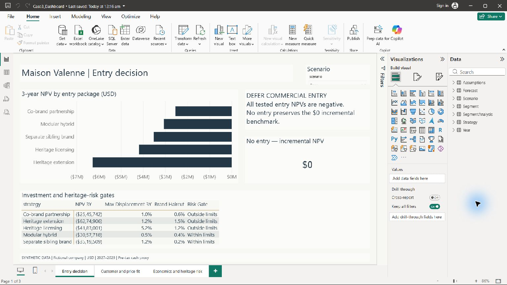
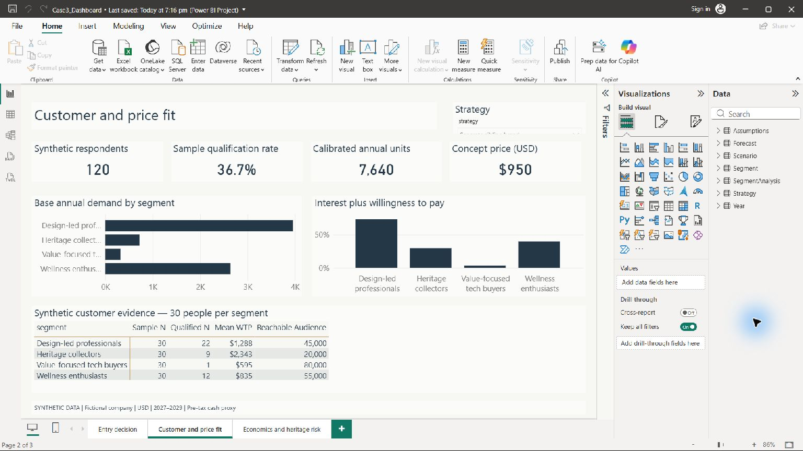
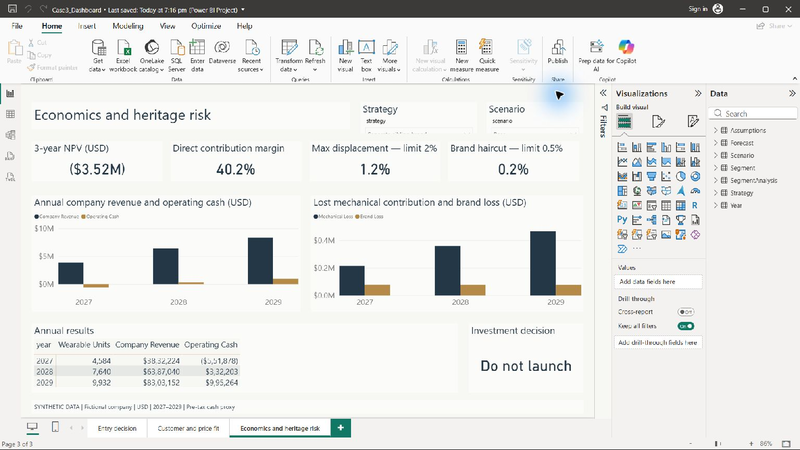
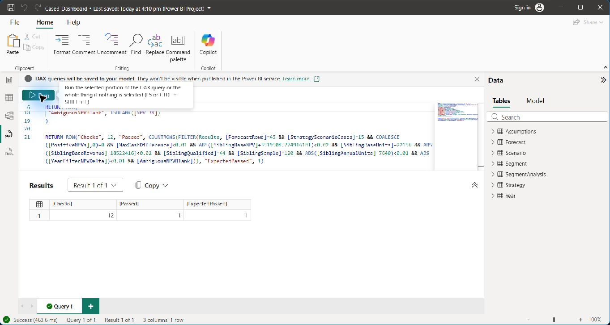

# Case 3 — Luxury Brand Paradox & Smart-Wearable Market Entry

**A fictional, synthetic Business Analyst / Strategy Analyst portfolio case.** Maison Valenne is not a real company. All survey, reach, cost and risk data are invented for learning. Public competitor references are labeled separately. USD, US scenario, 2027–2029.

## Recommendation
**Defer a full commercial launch.** None of five entry packages delivers positive three-year NPV. Co-branding has the smallest base loss (-$2.55m); the proposed separate sibling brand has -$3.52m. No entry provides a $0 incremental benchmark. The sibling architecture protects the heritage brand better under the assumptions, but does not win the investment decision.

Its approximate break-even demand is 1.71× base; the 2% mechanical-displacement gate binds at 1.68×. More volume alone is insufficient. A conditional sibling concept is developed in the strategy memo for future evidence gathering, including target, architecture, price, supplier and distribution choices.

## Start here
- [Strategy memo](docs/STRATEGY_MEMO.md): business problem, alternatives, market/customer context, MECE, SWOT, economics, risks and execution gates.
- [Excel analysis](excel/Case3_Analysis.xlsx): formula-driven qualification, demand, cash flow, NPV and four-price test.
- [Power BI screenshots and interpretation](#power-bi-screenshots-and-interpretation): findings, validation evidence and final decision.
- [Power BI build guide](powerbi/BUILD_GUIDE.md): exact three-page report layout, relationships, slicers, visuals and acceptance checks.
- [Power BI layout mockup](powerbi/dashboard_mockup.html): download/open locally; static preview only, not a working dashboard.
- [Data model](docs/DATA_MODEL.md) and [dictionary](docs/data_dictionary.csv).
- [Validation report](validation/VALIDATION_REPORT.md).

## Folder structure
```text
data/raw/          Seven compact synthetic input CSVs
data/processed/    Reconciled facts, strategy comparison and sensitivity outputs
sql/               MySQL schema, seed, views, quality checks and pricing query
excel/             Formula-based supporting analysis
powerbi/           Seven Power Query imports, DAX, theme and exact build guide
docs/              Strategy memo, data model and field dictionary
validation/        Actual MySQL outputs and cross-tool checks
scripts/           Reproducible generation and validation helpers
```

## What was completed
Business framing; 120 synthetic respondents and 600 concept responses; relational model; MySQL 8.0.46 schema/seed/views executed in an isolated local database; meaningful SQL analysis; Excel formula model; five-option strategy analysis plus no entry; price and demand sensitivity; public competitor references; Power BI datasets, model, DAX and three-page specification; calculation reconciliation; repository documentation.

## Power BI screenshots and interpretation

These are static screenshots of the report built in local Power BI Desktop, using synthetic Maison Valenne data for the US, in USD, for 2027–2029. They are evidence of the report and its checks, not an interactive dashboard or real customer research. Financial comparisons below use the Base scenario; the customer and economics pages show the separate sibling brand.

### 1. Entry decision — should the company enter?



The chart compares three-year NPV for five mutually exclusive entry packages against the $0 incremental no-entry benchmark. Every package has negative Base NPV: co-branding has the smallest loss (about −$2.55 million), while the sibling brand is about −$3.52 million; the risk table also shows that meeting heritage-risk limits does not guarantee a viable investment. **Decision implication:** defer commercial entry rather than select the least-negative package as a launch recommendation.

### 2. Customer and price fit — who fits the sibling concept?



At the $950 concept price, 44 of 120 synthetic respondents qualify (36.7%), and the model translates qualification, reachable audiences and calibration assumptions into 7,640 base annual units. Design-led professionals have the strongest qualification rate (22 of 30), followed by wellness enthusiasts (12 of 30); these two segments also lead modeled demand. **Decision implication:** prioritize these groups for future concept and willingness-to-pay research, while treating modeled demand as an assumption to validate rather than proof of commercial viability; $950 is the concept price shown, not evidence of an optimal price.

### 3. Economics and heritage risk — does the sibling concept justify investment?



The sibling/Base view shows a 40.2% direct contribution margin, maximum mechanical displacement of about 1.2% (below the 2% limit), and a 0.2% brand haircut (below the 0.5% limit). Despite growing revenue and improving annual operating cash, three-year NPV remains about −$3.52 million after the model's investment, operating-cost and heritage-loss assumptions. **Decision implication:** do not launch under the current assumptions; passing the heritage-risk gates and earning a positive direct margin are insufficient when the overall investment still destroys modeled value.

### 4. DAX validation — are the reported calculations consistent?



The result shows Checks = 12, Passed = 1 and ExpectedPassed = 1: Passed is one combined result row that satisfies all 12 conditions, not just one successful check out of twelve. The conditions cover record counts, cash reconciliation, sibling/Base financial and customer measures, zero positive NPVs across the 15 strategy/scenario cases, and selected filter behavior. **Interpretation:** the tested calculations are internally consistent; this does not establish real-world forecast accuracy or exhaustive testing of every possible slicer combination.

### Final business decision

**Defer a full commercial launch.** None of the five strategies achieves positive three-year NPV in the tested scenarios. The sibling architecture remains a conditional concept for further evidence gathering because it limits heritage exposure, but its −$3.52 million Base NPV does not justify launch. Revisit the decision only after validated customer demand and revised economics support positive NPV while remaining within the heritage-risk limits; more volume alone is insufficient under the current model.

The report was built and checked locally, and the screenshots are available above. Upload of the downloadable PBIX and editable project files remains pending; these images should not be presented as a hosted interactive report.

## Run the SQL
Requires MySQL 8.0+. Use a new `luxury_case3` schema; the scripts never drop existing databases. In MySQL Workbench open and execute `01_schema.sql`, then `02_seed.sql`, `03_analysis.sql`, `04_quality_checks.sql` and `05_pricing.sql` in that order. The seed is the import path for the exact CSV data, so no `LOCAL INFILE` configuration is needed. Run seed only once; duplicate primary keys prevent silent duplication. For a repeat run use an empty schema or intentionally prepare a separate schema name. Read results from v_segment, v_forecast and v_summary.

Run `python scripts/check_outputs.py` from the repository to validate supplied CSVs and workbook caches using Python's standard library. `python scripts/generate_case.py` regenerates the fixed sample and core model outputs; it overwrites those artifacts. Excel regeneration uses the optional authoring library listed in scripts/README.md; using the delivered workbook needs only Excel-compatible software.

## Key numbers — synthetic Base scenario
| Package | 3-year NPV | Units | Max annual mechanical displacement | Brand haircut |
|---|---:|---:|---:|---:|
| Heritage extension | -$6.27m | 4,385 | 1.18% | 1.50% |
| Separate sibling brand | -$3.52m | 22,156 | 1.19% | 0.20% |
| Co-brand partnership | -$2.55m | 10,049 | 0.99% | 0.60% |
| Heritage licensing | -$4.18m | 33,060 | 5.19% | 1.20% |
| Modular hybrid | -$3.06m | 6,014 | 0.49% | 0.40% |

NPV is a pre-tax operating-cash proxy excluding working capital, terminal value and financing. Demand and risk inputs are assumptions, not estimates from actual consumers. Do not sum mutually exclusive strategies or scenarios. Results are conditional, not evidence against an actual brand's market entry.

## Sources
Public references and their price dates appear in [competitor_references.csv](data/competitor_references.csv). Apple $799 is a 2025 launch reference, not a current quote. TAG Heuer $2,450 is one specific model's accessed US price. Withings supports hybrid architecture context only. These references do not determine synthetic financial performance.

## Portfolio description
Evaluated five wearable entry strategies for a fictional luxury watch parent using synthetic customer data, MySQL and formula-based Excel. Built a reproducible financial model with cannibalization and brand-risk scenarios and prepared a three-page Power BI report specification. Recommended deferring launch because none of the tested packages met the investment criteria.
