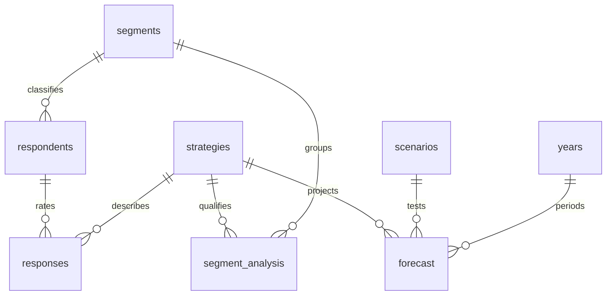

# Data model and lineage

All model inputs are synthetic. Public competitor references are isolated in `data/competitor_references.csv` and are not joined to financial facts.

`forecast` and `segment_analysis` are derived SQL views exported to CSV, not extra raw observations. `assumptions` has exactly one row, used by cross join. A CSV is one table and its first row is a header. UTF-8, comma delimiter, decimal point `.`, USD nominal dollars. The SQL seed and CSVs contain the same records. IDs are stable integer keys, without personal identifiers. No source contains real people.

| Table | Grain / key | Rows |
|---|---|---:|
| segments | primary need / segment_id | 4 |
| strategies | exclusive entry package / strategy_id | 5 |
| scenarios | sensitivity bundle / scenario_id | 3 |
| years | launch year / year | 3 |
| assumptions | model settings / assumption_id | 1 |
| respondents | synthetic person / respondent_id | 120 |
| responses | person × strategy / composite key | 600 |
| segment_analysis | strategy × segment | 20 |
| forecast | strategy × scenario × year | 45 |
| strategy_summary | strategy × scenario | 15 |
| pricing_test | sibling test price | 4 |
| thresholds | strategy, base assumptions | 5 |
| volume_sensitivity | strategy × demand multiple | 25 |

## Field dictionary
See `data_dictionary.csv` for every raw and principal derived column, type, unit and role. Key definitions:
- Interest is binary stated concept preference, not a forecast conversion.
- max_wtp is a synthetic person's maximum willingness-to-pay, common across concepts. This simplifying assumption limits brand-premium inference.
- reachable_buyers is an assumed refreshed annual audience; cannot be added across years as unique customers.
- realization is manufacturer revenue / retail price, except licensing where it is the royalty / retail price. Licensing unit_cogs is zero because licensee bears hardware costs.
- demand_factor captures assumed option awareness/distribution differences after qualification, not statistically estimated effect.
- cannibalization_rate is mechanical sales displaced per wearable unit; lost_mechanical_units may be fractional expected units.
- mechanical_margin is contribution margin on net manufacturer revenue, before corporate fixed costs.
- brand_haircut is a fraction of remaining mechanical contribution lost through price/mix erosion. It is not a market-observed brand valuation.
- initial_investment occurs at period 0; recurring annual_fixed occurs in each period. No initial investment is repeated in annual rows.
- rounded wearable units use half-up rounding for positive values across MySQL, Python and Excel.

## Assumption provenance
Synthetic generator seed 307 fixes the sample. WTP follows a truncated normal centered on the per-segment wtp_mean, standard deviation 28% of mean, minimum $250, rounded to $50. Interest uses segment mean plus documented option/segment adjustments in `scripts/generate_case.py`. Owner proportions and channel preferences are illustrative descriptors, not used to estimate causal switching or chosen channel mix. Financial costs, risk rates, demand factors and gates are author assumptions chosen to expose trade-offs, not optimized to make an option win. Scenario bundles are tests, not confidence intervals.

## Refresh
For original reproduction run `python scripts/generate_case.py`. This overwrites generated raw inputs with the fixed synthetic sample. For a new analytical scenario, change assumptions deliberately in the generator, regenerate, rerun SQL, regenerate Excel if its authoring library is available, and refresh Power BI. Editing Excel alone does not update CSVs. Do not change a CSV and retain old SQL/Excel conclusions. Copy the original case before experimenting.
